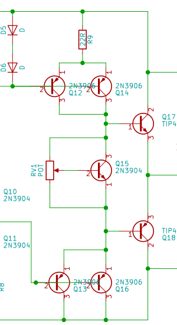

# Overview
  This is a DC coupled class AB amplifier. Additionally power supplies for the positive and negative rail are included on the same board (with the exception of the rectifier diodes and large input filter capacitors). The amplifier has an adjustable gain between 3 and 12 V/V. Everything is constructed from discrete transistors, resistors etc.

## "Voltage Gain Stage"
  * basically just an opamp made with discrete transitors
  * Set up as non-inverting amplifier.
    *  The reasoning behind this was to avoid the impedance of the source effecting the gain. Also using the the non-inverting configuration, the system doesn't have to be stable for unity gain; it only has to be stable for the minimum total gain (3 V/V in this case). However if I tried this with inverting configuration as soon as you unpluged the source the voltage divistion is lost and the system could be unstable.
    * All this said I think it would have been wiser to use an inverting configuration. This would lead to most points in the amplifier seeing essenitally no voltage swing. And I think that could have resulted in overall better performance
 
## Output Stage
  * Common Collector output
  * Adjustable Vbe multiplier to set bias point
  * Not much distortion (when operating by itself (open loop))

The way Vbe varies with temperature adversely effects the circuit. As the temperature of the output transistors increases their collector current increases for the same Vbe; this further increases the temperature. To keep this possitive feedback from turning into thermal runaway I put the Vbe multiplier transistor physically close to the output transitors. This way as the output transistors heat up they heat up this transistor, which reduces the bias voltage and works against the possitive feedback.

This stage has no voltage gain, but it greatly increases the impedance seen by the previous stages. Instead of the 6 ohm speaker it's roughly 6 * 30 * 150 ohms or 30 kOhms.

## Power supply
  * linear regulators for +- 10 volt rails
  This took me a while to get working. I wanted the dominant pole to be formed by the output impedance of the pass transistor and the output capacitor. However this meant that ESR of the output capacitor had to be very small if I wanted any reasonable amount of gain in the feedback path. So I multiple MLCCs in parallel as the output capacitor. I was also careful when laying out the pcb so that the resistance of the traces wouldn't "add" to the ESR as much as possible.

  However with this approch alone I would need very large output capacitors because my difference amplifier itself had a low frequency pole. In order to remedy this I added a capacitor is series with a resitor to the point with the troublesome pole. This had two effects
  1. created a new low frequency pole
  1. pushed the existing pole to a much higher frequency

The first thing may seem problematic, but I could make this pole very low frequency and its phase shift  was "canceled" by a zero before any other poles came into play. This essentially reduced the gain of the error amplifier for important frequencies, This was acceptable because even with this in place I had an open loop gain of 20 V/V or so for these interesting frequencies and that was plenty (open loop the output impedance was already on the order of an ohm)

